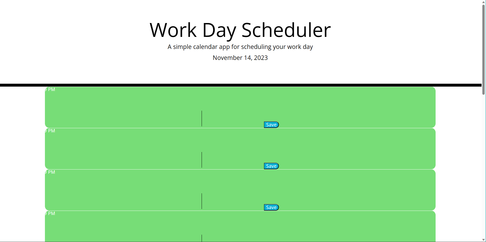

# Edxbootcamp_Module7challenge

## Description

We need to create a daily planner for the busy employees to scheduled their day.

## Task needed to achieve this module

* Display the current day at the top of the calendar when a user opens the planner.

* Present timeblocks for standard business hours when the user scrolls down.
  
* Color-code each timeblock based on past, present, and future when the timeblock is viewed.
  
* Allow a user to enter an event when they click a timeblock.
  
* Save the event in local storage when the save button is clicked in that timeblock.
  
* Persist events between refreshes of a page.

## Installation

N/A

## Usage 

N/A

## Output of the website

## Link to deployed application

(https://kurresailakshmareddy.github.io/edxbootcamp_Module7challenge/)

## License

none
